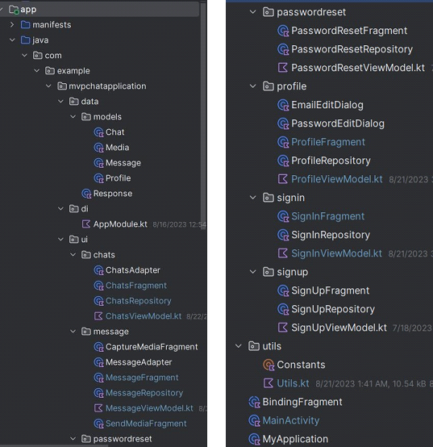

**App Name:** Chat App MVP (Android) 

**Architecture**: MVVM 

**Language & Tools:** Kotlin, XML, Coroutine, Flow, Supabase, Ktor, Glide, Hilt, CameraX 

**Features:**  

- Sign up, Sign in (email and password)
- Profile (upload profile image, name, phone, dob) 
- Search Users by email 
- One to One Chat (Text, Image and Video) 

**MVVM Design Concept:** 

** 

**Package Structure:** 

- **data**:  It contains data-related models, response etc. 

- **di**: Hilt dependency Injection package. This package contains only one file **SupabaseModule** which handles all the dependency injection logic for the app.  

- **ui**: package for everything that is required for displaying the user interface. It contains fragments and the corresponding adapters, viewmodels, and repositories. 
  - **chats**: fragments, viewmodels and repositories for showing chat lists and handling user search. 
  - **message**: fragments, viewmodels and repositories to handle sending text messages as well as capturing and sending images and videos. It captures images and videos and compresses them before uploading them to the server. 

- **passwordreset**: user can reset password using their email. It sends a recovery mail to the provided email and handles password reset when they click on the recovery email. 
- **profile**: fragment, viewmodel, repository for handling profile update, profile image upload, and two dialog fragments for changing email and password. 
- **signin**: User can sign in using their email and password. 
- **signup**: User can sign up using email and password. 

- **utils**: All other utility classes needed for the app. 
  - **BindingFragment**: This is the base fragment for all the fragments. This fragment is used to automate the creation and destruction of binding. 
  - **SupabaseLifecycleObserver**: This class handles realtime connection and disconnection with the change of MainActivity lifecycle like onCreate and onDestroy. 
  - **Utils:** This file contains all the other necessary utility methods, enums, objects, etc. 

\*\* You will find the corresponding state objects in every viewmodel like ChatUiState, MessageUiState, UploadState, InsertState, etc. This is a state base pattern so these states represent the specific state of the ui for different cases. 

**Schema(Supabase)**: 

